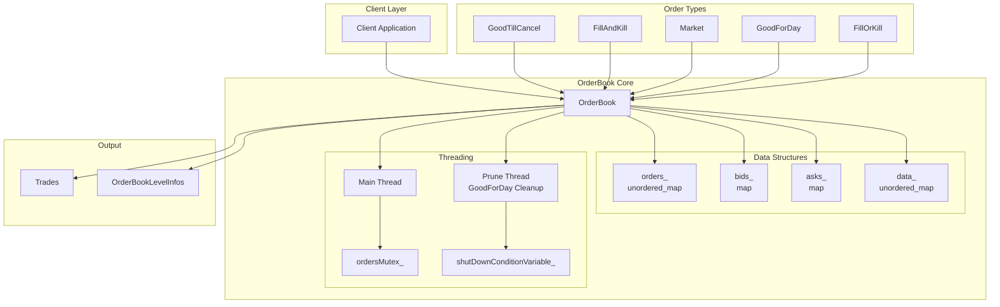
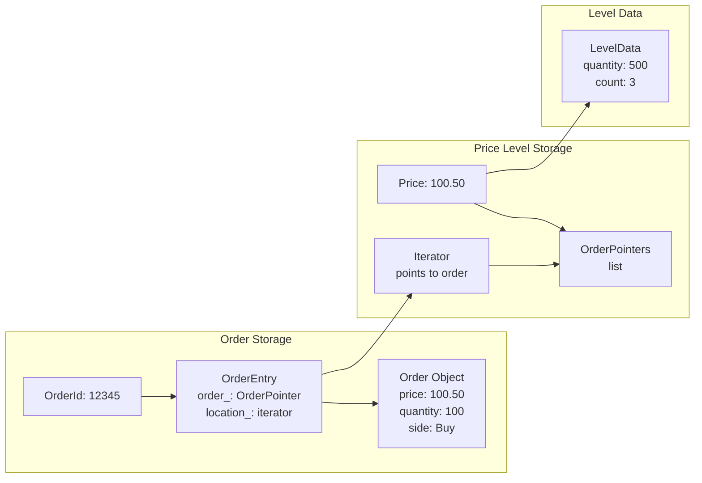
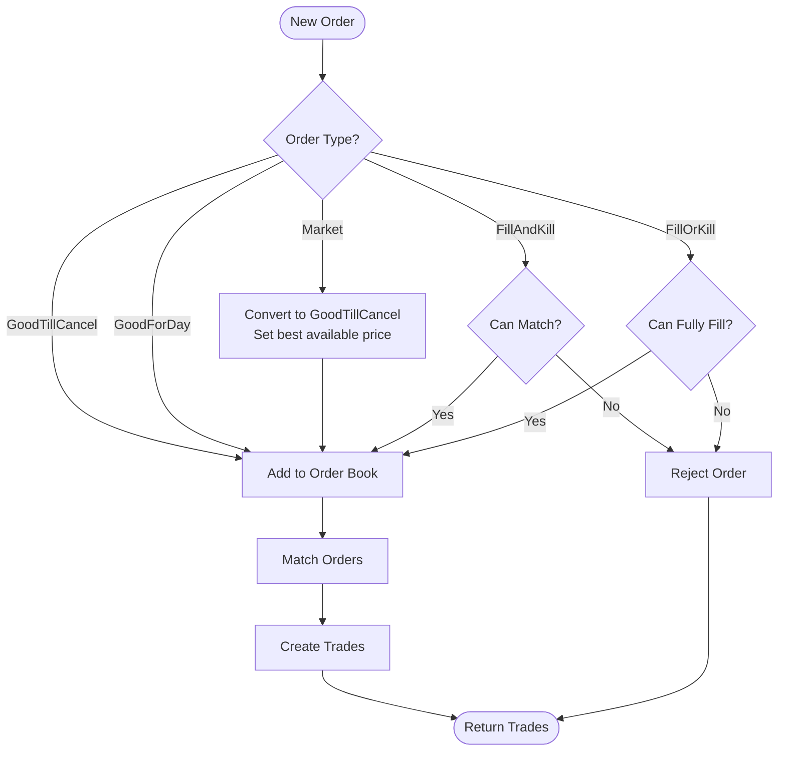
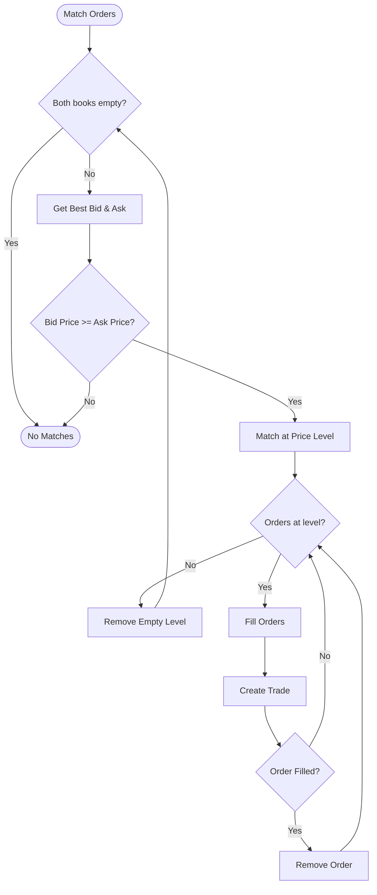
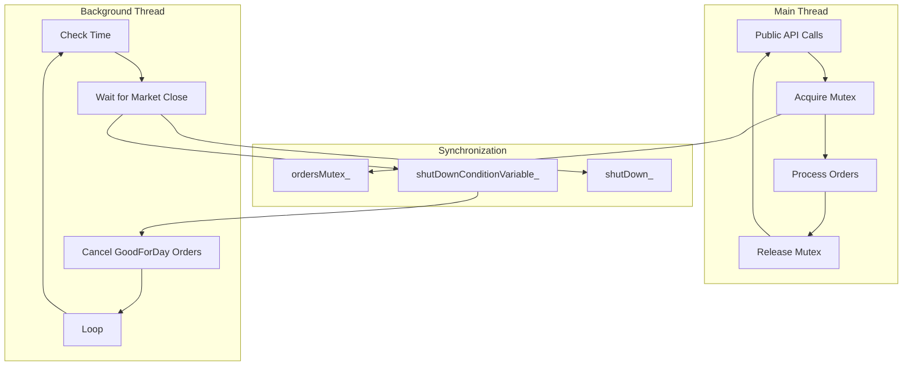
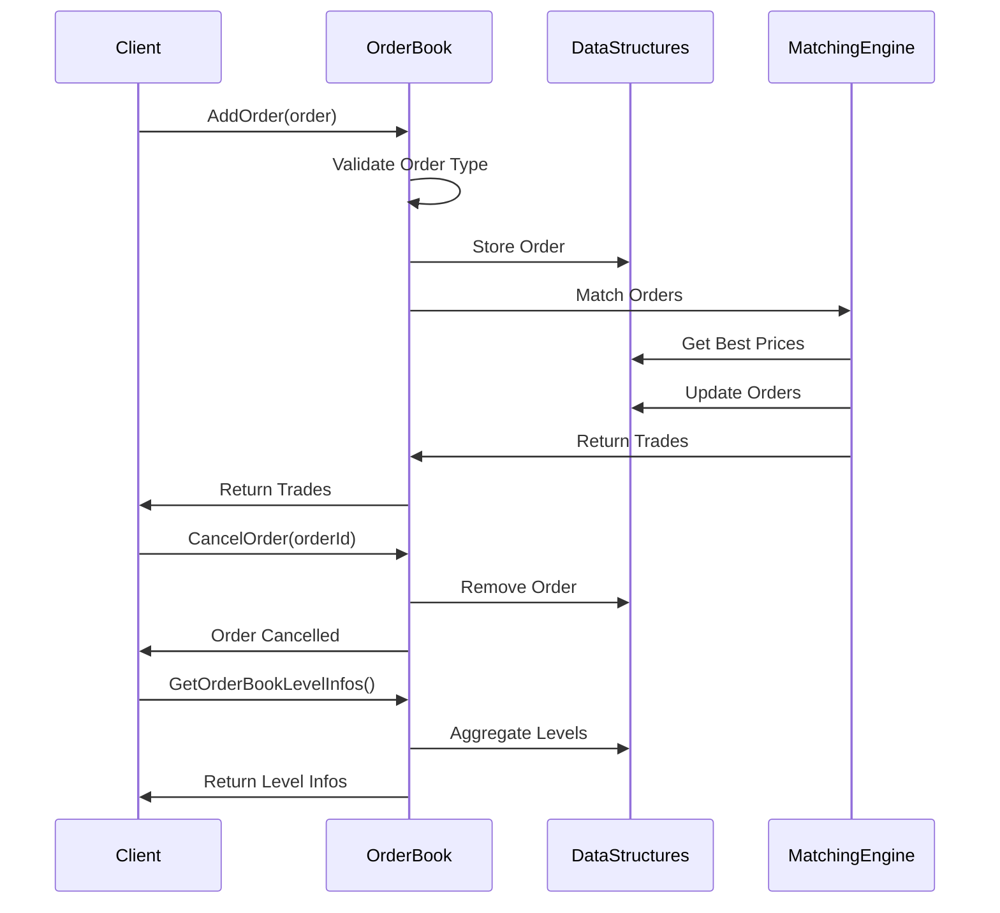

# OrderBook Trading System

A high-performance, thread-safe order book implementation in C++ designed for electronic trading systems. This project implements a complete matching engine that can handle various order types with efficient data structures and concurrent processing.

## 🎯 Core Features

- **Multiple Order Types**: Supports GoodTillCancel, FillAndKill, Market, GoodForDay, and FillOrKill orders
- **Real-time Matching**: Continuous order matching with price-time priority
- **Thread Safety**: Concurrent order processing with mutex-based synchronization
- **Automatic Cleanup**: Background thread for pruning GoodForDay orders at market close
- **High Performance**: O(1) order lookup and efficient matching algorithms

## 🏗️ Architecture Overview

### System Architecture Diagram



### Core Components

1. **OrderBook**: Main matching engine that manages order lifecycle
2. **Order**: Individual order representation with various types and states
3. **Trade**: Result of matched orders between buyers and sellers
4. **OrderModify**: Order modification functionality
5. **LevelInfo**: Price level aggregation for market depth

## 📊 Data Structures

### Data Structure Relationships



### Primary Data Structures

#### 1. Order Storage
```cpp
// O(1) order lookup by OrderId
unordered_map<OrderId, OrderEntry> orders_;

// Price-sorted order books
map<Price, OrderPointers, greater<Price>> bids_;    // Descending (highest first)
map<Price, OrderPointers, less<Price>> asks_;       // Ascending (lowest first)
```

#### 2. Order Entry Structure
```cpp
struct OrderEntry {
    OrderPointer order_ = nullptr;
    OrderPointers::iterator location_;  // Iterator for O(1) removal
};
```

#### 3. Level Data for FillOrKill Orders
```cpp
struct LevelData {
    Quantity quantity_{};
    Quantity count_{};
    enum class Action { Add, Remove, Match };
};
unordered_map<Price, LevelData> data_;
```

### Why These Choices?

- **`list<OrderPointer>`**: Provides stable iterators that don't invalidate during insertions/deletions
- **`map` with custom comparators**: Maintains price-time priority automatically
- **`unordered_map` for orders**: O(1) lookup by OrderId
- **Iterator-based removal**: O(1) removal without searching

## 🔄 Core Logic

### Order Processing Flow



### Order Matching Algorithm



1. **Price-Time Priority**: Orders are matched based on best price first, then by time
2. **Continuous Matching**: The system continuously attempts to match orders after each addition
3. **Partial Fills**: Orders can be partially filled and remain in the book
4. **Order Type Handling**: Different order types have specific matching rules

```cpp
// Matching Logic Flow
while (bids_.empty() == false && asks_.empty() == false) {
    auto& [bidPrice, bids] = *bids_.begin();
    auto& [askPrice, asks] = *asks_.begin();
    
    if (bidPrice < askPrice) break;  // No more matches possible
    
    // Match orders at this price level
    while (bids.size() > 0 && asks.size() > 0) {
        // Fill orders and create trades
    }
}
```

### Order Type Processing

#### Market Orders
- Converted to GoodTillCancel orders with best available price
- Buy orders: Use lowest ask price
- Sell orders: Use highest bid price

#### FillAndKill Orders
- Must match immediately or be cancelled
- Check `canMatch()` before adding to book

#### FillOrKill Orders
- Must be fully filled or cancelled
- Check `canFullyFill()` using level data

#### GoodForDay Orders
- Automatically cancelled at market close (4:00 PM)
- Background thread handles pruning

## 🔒 Concurrency Methods

### Threading Architecture



### Thread Safety Implementation

#### 1. Mutex-Based Synchronization
```cpp
mutable mutex ordersMutex_;
condition_variable shutDownConditionVariable_;
atomic<bool> shutDown_{false};
```

#### 2. Background Thread Management
```cpp
thread ordersPruneThread_;  // Handles GoodForDay order cleanup
```

#### 3. Locking Strategy
- **Scoped Locks**: RAII-based locking for automatic cleanup
- **Condition Variables**: Efficient waiting for shutdown signals
- **Atomic Operations**: Lock-free shutdown coordination

#### 4. Thread-Safe Operations
```cpp
// Public API with proper locking
void CancelOrder(OrderId orderId) {
    std::scoped_lock ordersLock{ordersMutex_};
    CancelOrderInternal(orderId);
}

// Batch operations to minimize lock contention
void CancelOrders(OrderIds orderIds) {
    std::scoped_lock ordersLock{ordersMutex_};
    for (const auto& orderId : orderIds) {
        CancelOrderInternal(orderId);
    }
}
```

### Concurrency Benefits

- **Minimal Lock Contention**: Batch operations reduce lock/unlock cycles
- **Efficient Waiting**: Condition variables for time-based operations
- **Graceful Shutdown**: Atomic flags and condition variables for clean termination
- **RAII Safety**: Automatic resource cleanup with scoped locks

## 🚀 Performance Characteristics

### Performance Metrics

```mermaid
graph LR
    subgraph "Time Complexity"
        Add[Add Order<br/>O(log n)]
        Cancel[Cancel Order<br/>O(1)]
        Lookup[Order Lookup<br/>O(1)]
        Match[Order Matching<br/>O(k)]
    end
    
    subgraph "Space Complexity"
        Storage[Order Storage<br/>O(n)]
        Levels[Price Levels<br/>O(p)]
        Data[Level Data<br/>O(p)]
    end
    
    subgraph "Operations"
        BestPrice[Best Price Access<br/>O(1)]
        Iterator[Iterator Operations<br/>O(1)]
        Batch[Batch Operations<br/>Optimized]
    end
```

### Time Complexities
- **Order Addition**: O(log n) for price insertion + O(1) for matching
- **Order Cancellation**: O(1) using stored iterators
- **Order Lookup**: O(1) by OrderId
- **Best Price Access**: O(1) using map iterators
- **Order Matching**: O(k) where k is number of price levels involved

### Space Complexities
- **Order Storage**: O(n) where n is total number of orders
- **Price Levels**: O(p) where p is number of unique price levels
- **Level Data**: O(p) for FillOrKill order tracking

## �� API Reference

### API Flow Diagram



### Core Methods

```cpp
// Order Management
Trades AddOrder(OrderPointer order);
void CancelOrder(OrderId orderId);
Trades ModifyOrder(OrderModify order);

// Query Methods
size_t Size() const;
OrderBookLevelInfos GetOrderBookLevelInfos() const;
```

### Order Types Supported

1. **GoodTillCancel**: Standard limit orders that remain until filled/cancelled
2. **FillAndKill**: Immediate execution or cancellation
3. **Market**: Execute at best available price
4. **GoodForDay**: Valid until market close
5. **FillOrKill**: Must be fully filled or cancelled

## 🛠️ Usage Example

```cpp
// Create order book
OrderBook orderBook;

// Add a buy order
auto buyOrder = std::make_shared<Order>(
    OrderType::GoodTillCancel, 
    1,           // OrderId
    Side::Buy, 
    100.50,      // Price
    100          // Quantity
);
auto trades = orderBook.AddOrder(buyOrder);

// Add a matching sell order
auto sellOrder = std::make_shared<Order>(
    OrderType::GoodTillCancel, 
    2,           // OrderId
    Side::Sell, 
    100.50,      // Price
    50           // Quantity
);
trades = orderBook.AddOrder(sellOrder);

// Get order book state
auto levelInfos = orderBook.GetOrderBookLevelInfos();
```

## 📋 Build Requirements

- **C++17** or later (uses `std::format`, structured bindings)
- **Standard Library**: `<map>`, `<unordered_map>`, `<list>`, `<thread>`, `<mutex>`
- **Compiler**: GCC 8+, Clang 7+, or MSVC 2019+

## 🎯 Key Design Decisions

1. **Iterator Stability**: Using `list` instead of `vector` for stable iterators
2. **Price Sorting**: Custom comparators for automatic price-time priority
3. **Event-Driven Updates**: Level data updates for FillOrKill order validation
4. **Background Processing**: Dedicated thread for time-based operations
5. **RAII Resource Management**: Automatic cleanup with smart pointers and scoped locks

## 🔍 Future Enhancements

- **Order Book Snapshots**: Efficient state serialization
- **Market Data Feeds**: Real-time price and volume updates
- **Order Routing**: Multi-venue order routing capabilities
- **Performance Monitoring**: Latency and throughput metrics
- **Configuration Management**: Runtime order type and parameter configuration

---

This OrderBook implementation provides a robust foundation for electronic trading systems with emphasis on performance, thread safety, and maintainability.
